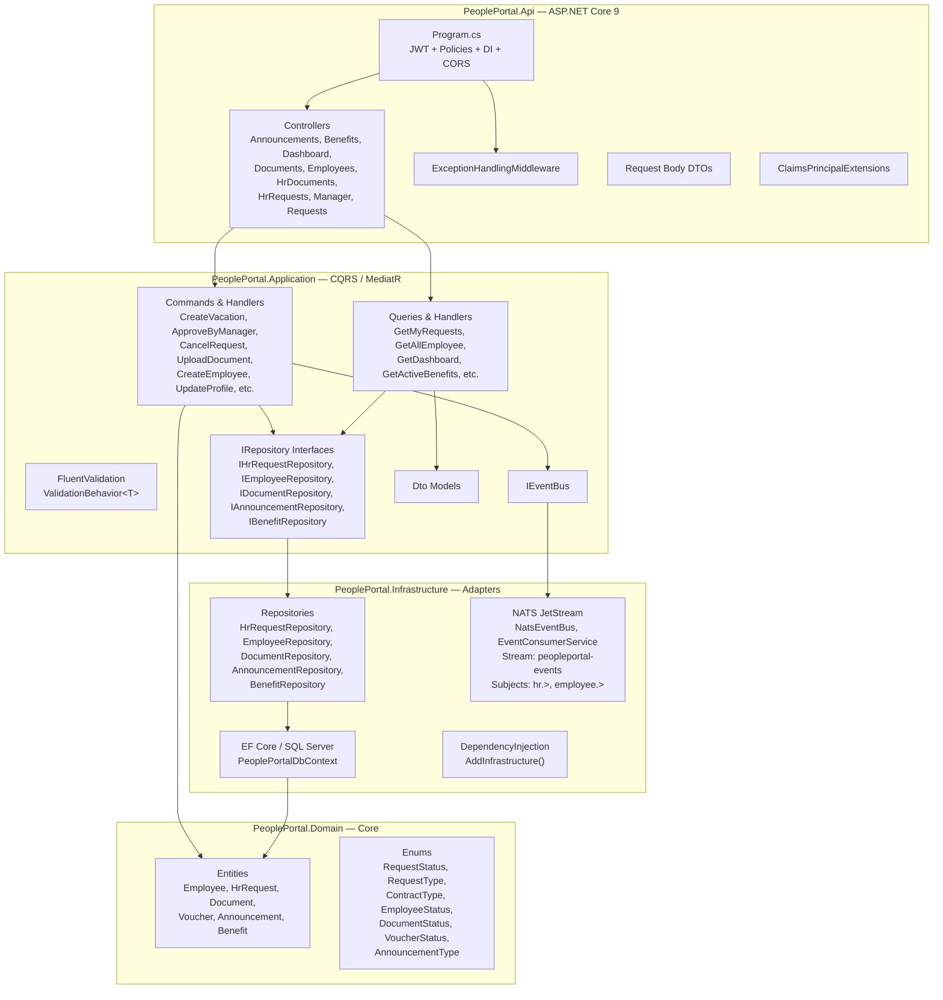
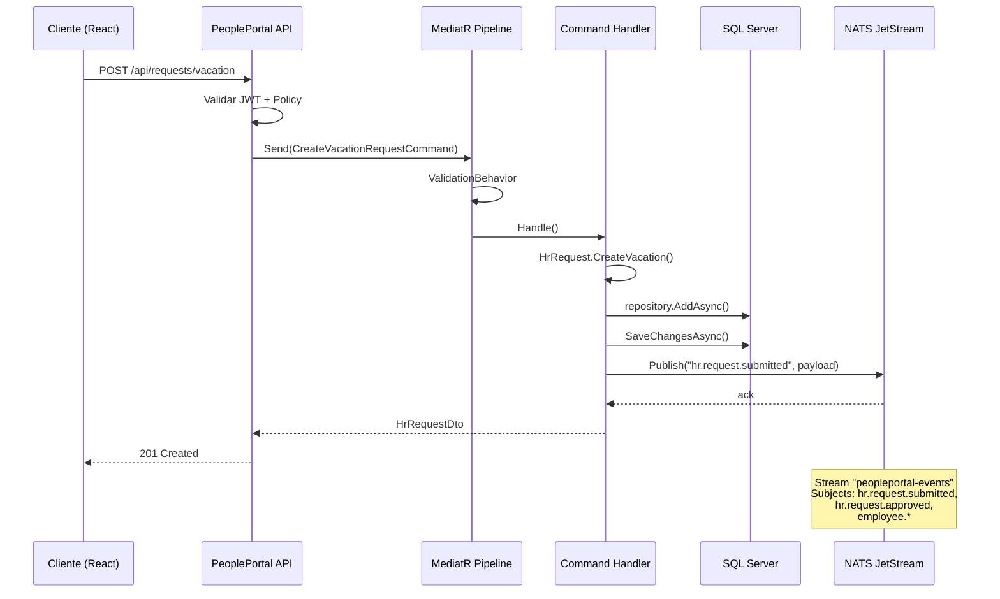
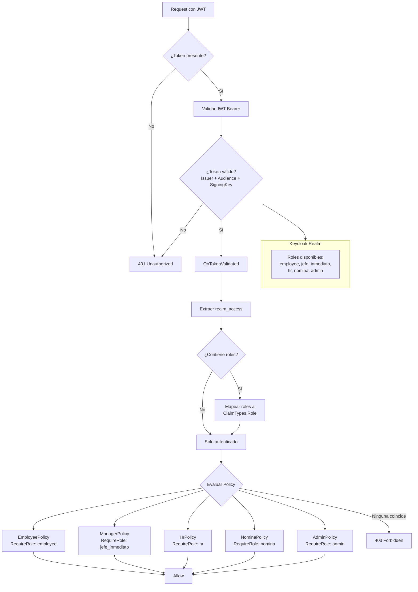

# PeoplePortal — Documentación del Backend

## 1. Arquitectura por Capas (Clean Architecture)



---

## 2. Flujo de Eventos



---

## 3. Autenticación y Autorización



---

## 4. Endpoints de la API

| Controller | Método | Ruta | Auth Policy |
|---|---|---|---|
| **RequestsController** | POST | `/api/requests/vacation` | EmployeePolicy |
| | POST | `/api/requests/certificate` | EmployeePolicy |
| | POST | `/api/requests/voucher` | EmployeePolicy |
| | POST | `/api/requests/{id}/cancel` | EmployeePolicy |
| | GET | `/api/requests/me` | EmployeePolicy |
| **ManagerController** | PATCH | `/api/manager/requests/{id}/status` | ManagerPolicy |
| **HrRequestsController** | GET | `/api/hr/requests` | HrPolicy |
| | PATCH | `/api/hr/requests/{id}/status` | HrPolicy |
| **DocumentsController** | GET | `/api/documents/me` | EmployeePolicy |
| **HrDocumentsController** | GET | `/api/hr/documents` | HrPolicy |
| | POST | `/api/hr/documents` | HrPolicy |
| | PATCH | `/api/hr/documents/{id}/status` | HrPolicy |
| **DashboardController** | GET | `/api/dashboard` | EmployeePolicy |
| **AnnouncementsController** | GET | `/api/announcements` | EmployeePolicy |
| | POST | `/api/hr/announcements` | HrPolicy |
| **BenefitsController** | GET | `/api/benefits` | EmployeePolicy |
| **EmployeesController** | GET | `/api/employees/me` | EmployeePolicy |
| | PUT | `/api/employees/me` | EmployeePolicy |
| | GET | `/api/hr/employees` | HrPolicy |
| | GET | `/api/hr/employees/{id}` | HrPolicy |
| | POST | `/api/hr/employees` | HrPolicy |
| | PUT | `/api/hr/employees/{id}` | HrPolicy |
| Health Checks | GET | `/health` | Público |

---

## 5. Estructura del Proyecto

```
BackEnd/
├── PeoplePortal.sln
├── Dockerfile
├── docker-compose.yml
├── src/
│   ├── PeoplePortal.Domain/          # Capa de dominio
│   │   ├── Entities/                 #   Employee, HrRequest, Document, Voucher, Announcement, Benefit
│   │   └── Enums/                    #   RequestStatus, RequestType, ContractType, EmployeeStatus, etc.
│   │
│   ├── PeoplePortal.Application/     # Capa de aplicación (CQRS)
│   │   ├── Common/
│   │   │   ├── Behaviors/            #   ValidationBehavior<T>
│   │   │   └── Interfaces/           #   IEventBus
│   │   ├── Contracts/Persistence/    #   Repositorios (interfaces)
│   │   ├── Announcements/            #   Commands/Queries/Dtos/Mappings
│   │   ├── Benefits/                 #   Queries/Dtos/Mappings
│   │   ├── Dashboard/                #   Queries/Dtos
│   │   ├── Documents/                #   Commands/Queries/Dtos/Mappings
│   │   ├── Employees/                #   Commands/Queries/Dtos/Mappings
│   │   ├── Requests/                 #   Commands/Queries/Dtos/Mappings
│   │   ├── Vouchers/                 #   Commands/Queries/Dtos/Mappings
│   │   └── DependencyInjection.cs
│   │
│   ├── PeoplePortal.Infrastructure/  # Capa de infraestructura
│   │   ├── Messaging/                #   NatsEventBus, EventConsumerService
│   │   ├── Persistence/
│   │   │   ├── Migrations/           #   EF Core migrations
│   │   │   ├── Repositories/         #   Implementaciones de repositorios
│   │   │   ├── PeoplePortalDbContext.cs
│   │   │   └── PeoplePortalDbContextFactory.cs
│   │   └── DependencyInjection.cs
│   │
│   └── PeoplePortal.Api/            # Capa de presentación (API)
│       ├── Controllers/              #   9 controladores
│       ├── Middleware/               #   ExceptionHandlingMiddleware
│       ├── Extensions/               #   ClaimsPrincipalExtensions
│       ├── Contracts/                #   Request body DTOs
│       └── Program.cs                #   Startup: JWT, Policies, DI, CORS, Swagger
│
├── tests/                            # Pruebas
├── docs/                             # Documentación
│   ├── README.md                     # Este archivo
│   ├── arquitectura.md               # Diagramas C4
│   ├── base-de-datos.md              # Diagrama ER
│   ├── seguridad.md                  # OWASP Top 10
│   ├── flujos.md                     # Flujos del sistema
│   └── despliegue.md                 # Despliegue
├── deploy/                           # Scripts de despliegue
├── k8s/                              # Manifiestos Kubernetes
└── .github/                          # CI/CD (GitHub Actions)
```

---

## Stack Tecnológico

| Componente | Tecnología |
|---|---|
| Runtime | .NET 9 |
| Arquitectura | Clean Architecture + CQRS |
| Mediator | MediatR |
| Validación | FluentValidation |
| ORM | Entity Framework Core 9 |
| Base de datos | SQL Server 2022 |
| Mensajería | NATS JetStream |
| Autenticación | Keycloak (JWT Bearer + PKCE) |
| API Gateway | APISIX (plugin openid-connect) |
| Contenedores | Docker + docker-compose |
| Orquestación | Kubernetes |
| CI/CD | GitHub Actions + Trivy + Codacy |

> Para más detalle, ver `arquitectura.md`, `base-de-datos.md`, `seguridad.md`, `flujos.md` y `despliegue.md` en este directorio.
