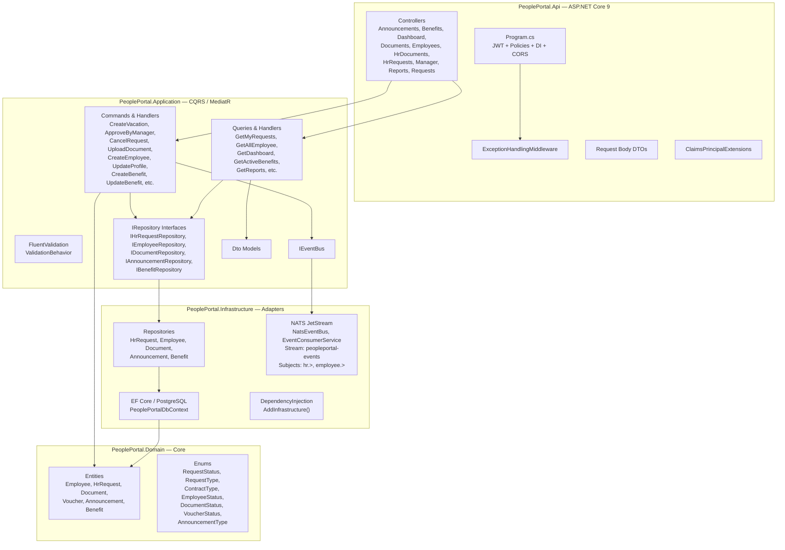
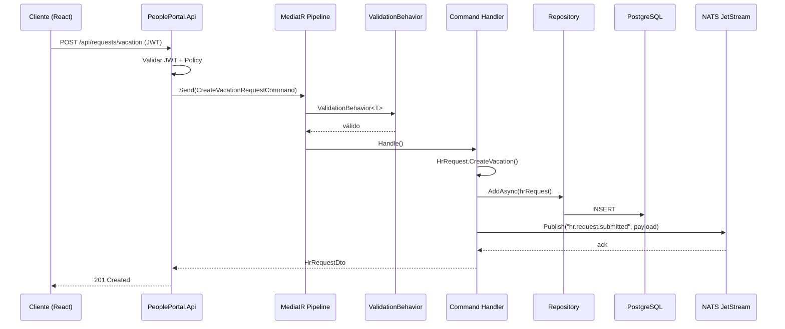
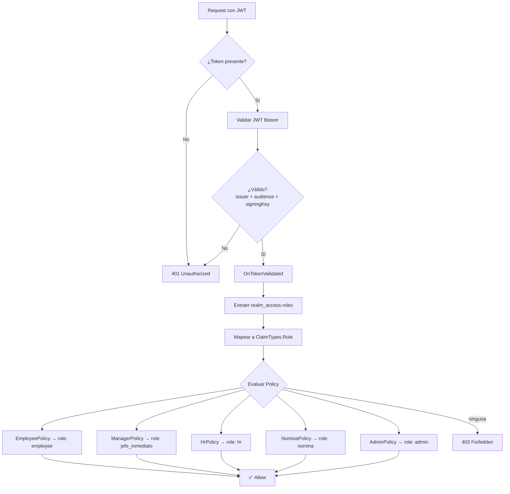

# Arquitectura — PeoplePortal BackEnd

## Clean Architecture: capas



---

## Flujo CQRS con MediatR



---

## Autenticación y autorización



---

## Estructura del proyecto

```
PeoplePortal-BackEnd/
├── src/
│   ├── PeoplePortal.Domain/
│   │   ├── Entities/          ← Employee, HrRequest, Document, Voucher, Announcement, Benefit
│   │   └── Enums/             ← RequestStatus, RequestType, ContractType, ...
│   │
│   ├── PeoplePortal.Application/
│   │   ├── Common/
│   │   │   ├── Behaviors/     ← ValidationBehavior<T>
│   │   │   └── Interfaces/    ← IEventBus
│   │   ├── Contracts/Persistence/  ← Interfaces de repositorios
│   │   ├── Announcements/
│   │   ├── Benefits/
│   │   ├── Dashboard/
│   │   ├── Documents/
│   │   ├── Employees/
│   │   ├── Requests/
│   │   ├── Reports/
│   │   ├── Vouchers/
│   │   └── DependencyInjection.cs
│   │
│   ├── PeoplePortal.Infrastructure/
│   │   ├── Messaging/         ← NatsEventBus, EventConsumerService
│   │   ├── Persistence/
│   │   │   ├── Migrations/
│   │   │   ├── Repositories/
│   │   │   └── PeoplePortalDbContext.cs
│   │   └── DependencyInjection.cs
│   │
│   └── PeoplePortal.Api/
│       ├── Controllers/       ← 10 controladores
│       ├── Middleware/        ← ExceptionHandlingMiddleware
│       ├── Extensions/        ← ClaimsPrincipalExtensions
│       ├── Contracts/         ← Request body DTOs
│       └── Program.cs
│
├── tests/
│   ├── PeoplePortal.UnitTests/
│   └── PeoplePortal.IntegrationTests/
└── docs/                      ← esta carpeta
```
