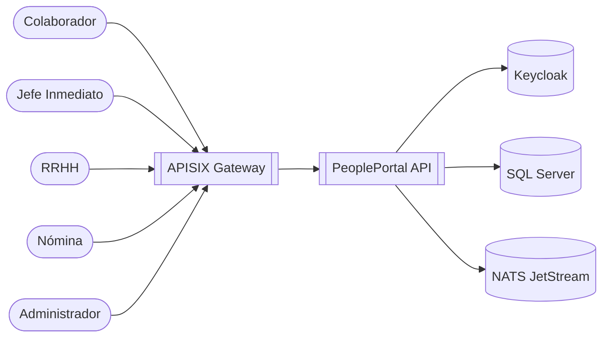
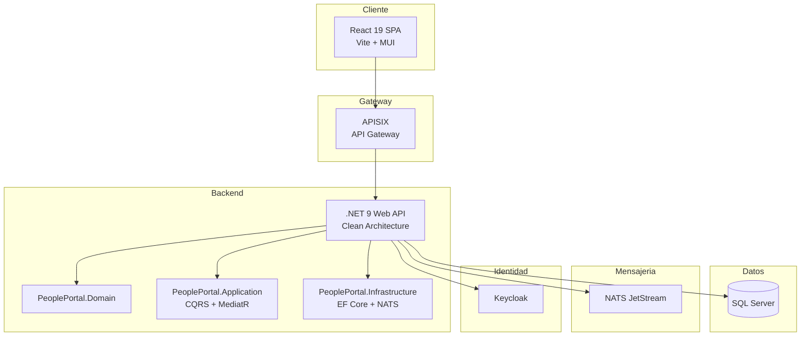

# Arquitectura — PeoplePortal

## C4 Nivel 1 — Diagrama de Contexto

## C4 Nivel 2 — Diagrama de Contenedores

## Stack tecnológico

| Componente | Tecnología |
|---|---|
| Backend | .NET 9, Clean Architecture, CQRS, MediatR |
| Frontend Colaborador | React 19, Vite, MUI v9, Keycloak-js |
| Frontend RRHH | React 19, Vite, MUI v9, Keycloak-js |
| Base de datos | SQL Server 2022, EF Core 9 |
| Autenticación | Keycloak (JWT + PKCE) |
| API Gateway | APISIX con plugin openid-connect |
| Mensajería | NATS JetStream |
| Contenedores | Docker + docker-compose |
| Orquestación | Kubernetes (manifiestos en /k8s) |
| CI/CD | GitHub Actions + Codacy + Trivy |
