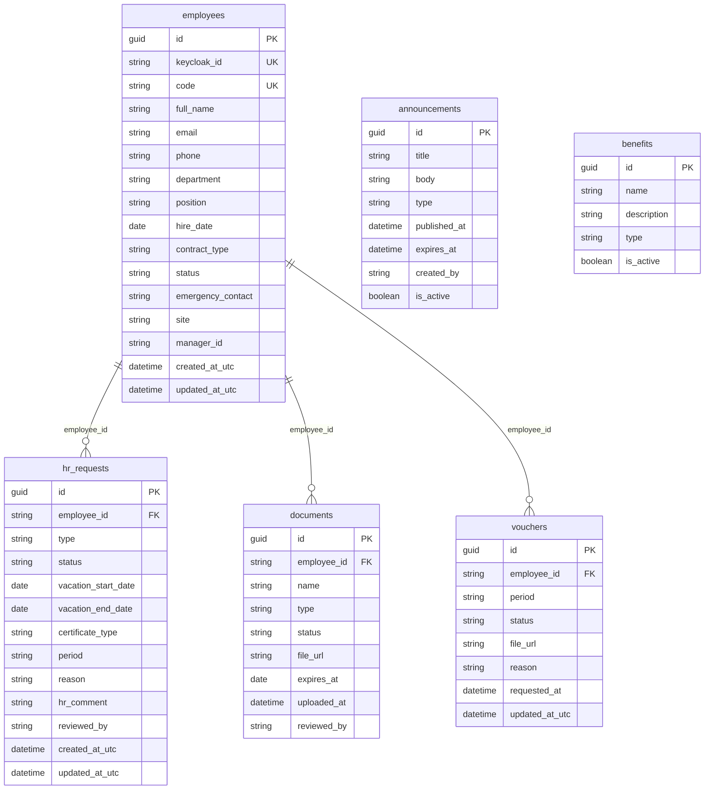

# Base de datos — PeoplePortal

Esquema SQL Server con naming snake_case.

## Convenciones
- Tablas en snake_case plural
- Columnas en snake_case
- Primary keys: `id`
- Foreign keys: `{tabla}_id`
- Índices: `ix_{tabla}_{columna}`
- Timestamps en UTC
