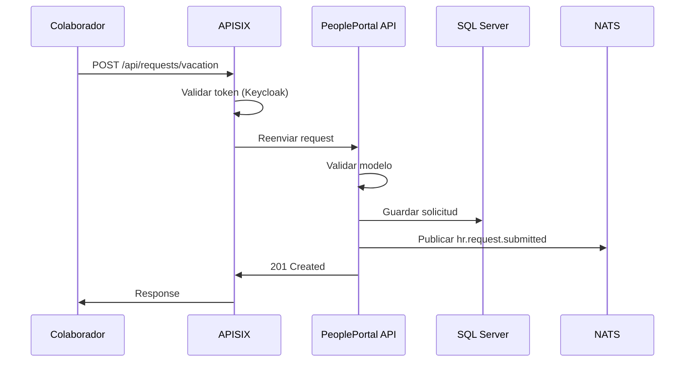
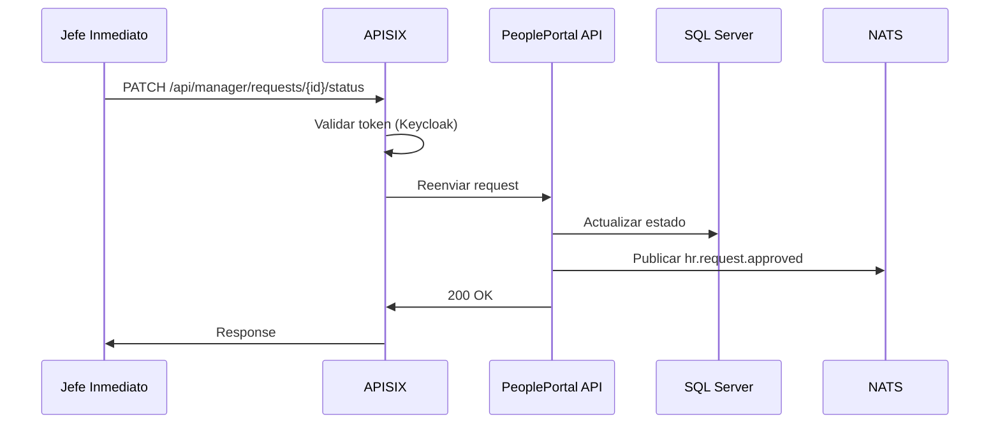
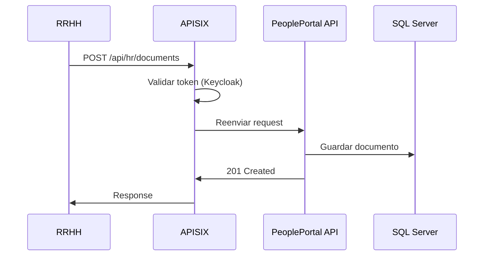
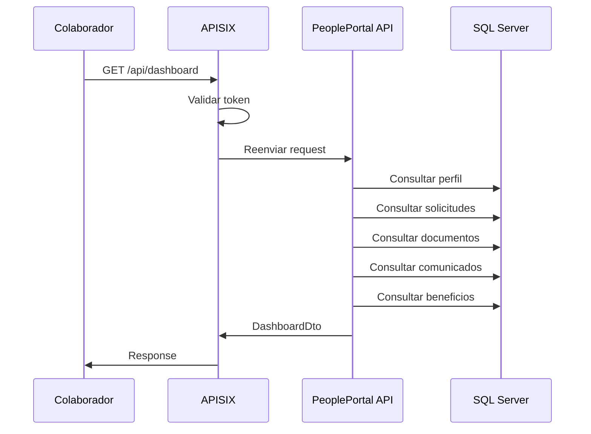

# Flujos del sistema — PeoplePortal

## Flujo: Solicitar vacaciones

```mermaid
sequenceDiagram
    participant C as Colaborador
    participant A as APISIX
    participant API as PeoplePortal API
    participant DB as SQL Server
    participant N as NATS
    
    C->>A: POST /api/requests/vacation
    A->>A: Validar token (Keycloak)
    A->>API: Reenviar request
    API->>API: Validar modelo
    API->>DB: Guardar solicitud
    API->>N: Publicar hr.request.submitted
    API->>A: 201 Created
    A->>C: Response
```

## Flujo: Aprobar solicitud (Jefe inmediato)

```mermaid
sequenceDiagram
    participant J as Jefe Inmediato
    participant A as APISIX
    participant API as PeoplePortal API
    participant DB as SQL Server
    participant N as NATS
    
    J->>A: PATCH /api/manager/requests/{id}/status
    A->>A: Validar token (Keycloak)
    A->>API: Reenviar request
    API->>DB: Actualizar estado
    API->>N: Publicar hr.request.approved
    API->>A: 200 OK
    A->>J: Response
```

## Flujo: Subir documento (RRHH)

```mermaid
sequenceDiagram
    participant H as RRHH
    participant A as APISIX
    participant API as PeoplePortal API
    participant DB as SQL Server
    
    H->>A: POST /api/hr/documents
    A->>A: Validar token (Keycloak)
    A->>API: Reenviar request
    API->>DB: Guardar documento
    API->>A: 201 Created
    A->>H: Response
```

## Flujo: Dashboard

```mermaid
sequenceDiagram
    participant C as Colaborador
    participant A as APISIX
    participant API as PeoplePortal API
    participant DB as SQL Server
    
    C->>A: GET /api/dashboard
    A->>A: Validar token
    A->>API: Reenviar request
    API->>DB: Consultar perfil
    API->>DB: Consultar solicitudes
    API->>DB: Consultar documentos
    API->>DB: Consultar comunicados
    API->>DB: Consultar beneficios
    API->>A: DashboardDto
    A->>C: Response
```
